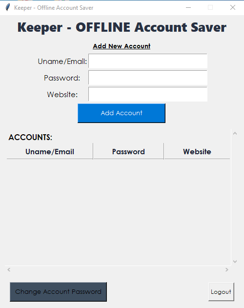
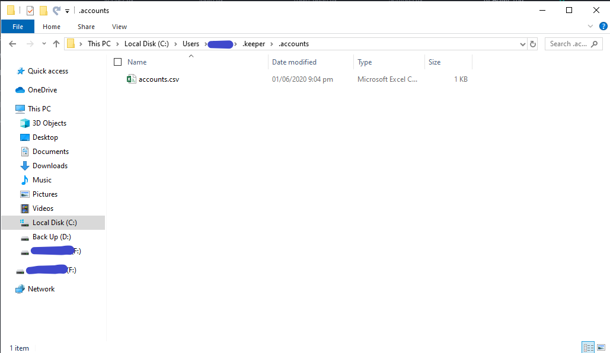

# AccKeeper
Simple Offline Accounts Keeper. It just simply keeps your personal accounts in a storage.

## How it works?
- Log in with the Administrator password.
- Automatically View and add new personal accounts to keep them.

### Python 3.x Modules
- tkinter
- pandas, csv
- hashlib, json
- os

## Images
- **Login Window**

- **Main APP**

- **Change Password**

### First (1st) Launch / Start
1. **Initialization**
****
- It creates a folder named '*.keeper*' in the user directory which is the main storage for the app password and the accounts.

- Then, it creates a json file named *config.json* which is the main storage for the master / administrator password.
- After logging in, it creates the directory *.accounts*

2. **Main Dashboard**
****
- In the *.accounts* folder, it generates a blank csv file *accounts.csv* which is the main database for all of the accounts.

### Configuration
**Default Password**: admin123

_You can change the password by clicking on the [Change Account Password] button in the main dashboard_

### TODOs:
- [ ] Make the *.accounts* folder hidden and the *accounts.csv* read-only.
- [ ] Add features Delete and Update on the accounts stored.
- [ ] Encrypt Datas being stored in the *accounts.csv*
- [ ] Fix other errors to be encountered.
- [ ] Improve UI Design
- [ ] Build APP for deployment.

#### Made By:
:heart: **TheBoringDude**
